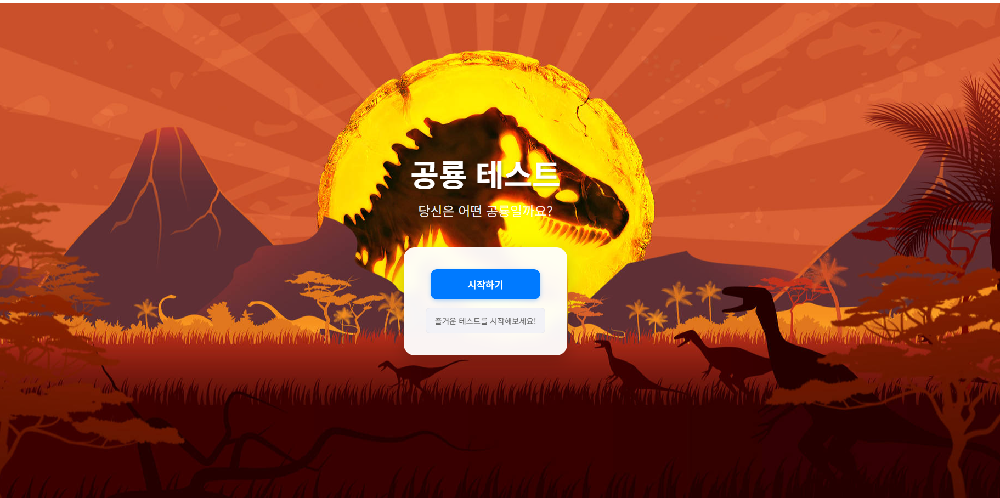

<p align="center">
  
</p>

<h1 align="center">🦖 Dinosaur Personality Test — 공룡 성격 심리 테스트</h1>

<p align="center">
  10개의 질문에 답하면, 당신과 닮은 <b>공룡 캐릭터</b>가 결과로 나타납니다.<br>
  AI 이미지 생성과 심리 로직을 결합한 <b>인터랙티브 웹 프로젝트</b>
</p>

<p align="center">
  <a href="https://github.com/jini-c/dinosaur-test/stargazers">
    
  </a>
  <a href="https://github.com/jini-c/dinosaur-test/issues">
    
  </a>
  
  
  
</p>

<p align="center">
  <a href="#-핵심-기능">핵심 기능</a> ·
  <a href="#-프로젝트-구조">프로젝트 구조</a> ·
  <a href="#-이미지-생성-스토리">이미지 생성 스토리</a> ·
  <a href="#-스크린샷">스크린샷</a> ·
  <a href="#-빠른-시작">빠른 시작</a> ·
  <a href="#-기술-스택">기술 스택</a> ·
  <a href="#-문서">문서</a> ·
  <a href="#-크레딧">크레딧</a>
</p>

---

## ✨ 핵심 기능
- 10개의 질문 → 점수 계산 → 공룡 캐릭터 매칭
- 공룡마다 다른 성격 설명 & 히든 능력치
- 결과 페이지 카드 UI + 설명 표시
- GPT 프롬프트로 **동일 스타일** 공룡 이미지 제작
- 심리검사를 “게임처럼” 소비하도록 흐름 구성

---

## 🧭 프로젝트 구조

```
jurassic-personality-test/
├─ docs/
│ ├─ image/ # 카드/결과/샘플 이미지
│ │ ├─ dino-card-main.png
│ │ ├─ tirano.png, velo.png, briki.png, miasau.png ...
│ ├─ logic.md # 점수 계산 로직 문서
│ └─ prompts.md # 이미지 프롬프트 가이드
├─ index.html # 메인 실행 파일
├─ script.js # 질문/점수 계산/페이지 전환 로직
├─ styles.css # 스타일
├─ 발표.html # 발표용 HTML
├─ README.md
└─ .gitignore
```
---

## 🎨 이미지 생성 스토리
- GPT 이미지 생성을 활용해 **일관된 카드 스타일**을 확보했습니다.
- 각 성격 유형(리더형/전략가형/온화형/공감형 등)에 맞춘 속성 바(지능/용기/사교성/공격성/적응력/호기심)를 설계해 카드에 반영했습니다.
- 프롬프트를 여러 번 조정하며 캐릭터 라인업(티라노/벨로시랩터/브라키오/마이아사우라/스피노/트리케라톱스/안킬로/파라사우롤로푸스)의 **스타일 통일성**을 맞췄습니다.

<p align="center">
  
</p>
<p align="center"><em>예시: 스피노사우루스 카드</em></p>

---

## 🖼️ 스크린샷
<p align="center">
  
</p>
<p align="center"><em>랜딩: 공룡 실루엣 배경 + '시작하기' 버튼</em></p>

<p align="center"><em>결과 카드 예시</em></p>
<p align="center">
  
  
</p>
<p align="center">
  
  
</p>

---

## 🚀 빠른 시작

# 클론
git clone https://github.com/jini-c/dinosaur-test.git
cd dinosaur-test

# 실행 (브라우저에서 열기)
# Mac
open index.html
# Windows
start index.html
# 또는 파일 탐색기에서 index.html 더블클릭

---

## 🧩 기술 스택

Frontend: HTML5, CSS3, JavaScript(ES6+)

AI: GPT 이미지 프롬프트 기반 캐릭터 생성

협업: GitHub, VS Code

---

## 📑 문서

docs/logic.md
 — 점수 계산 로직

docs/prompts.md
 — 이미지 프롬프트 가이드

---

## 🙌 크레딧

AI 이미지 생성 & 로직 구현: jini-c

UI/UX 및 화면 설계: 팀원 조성민